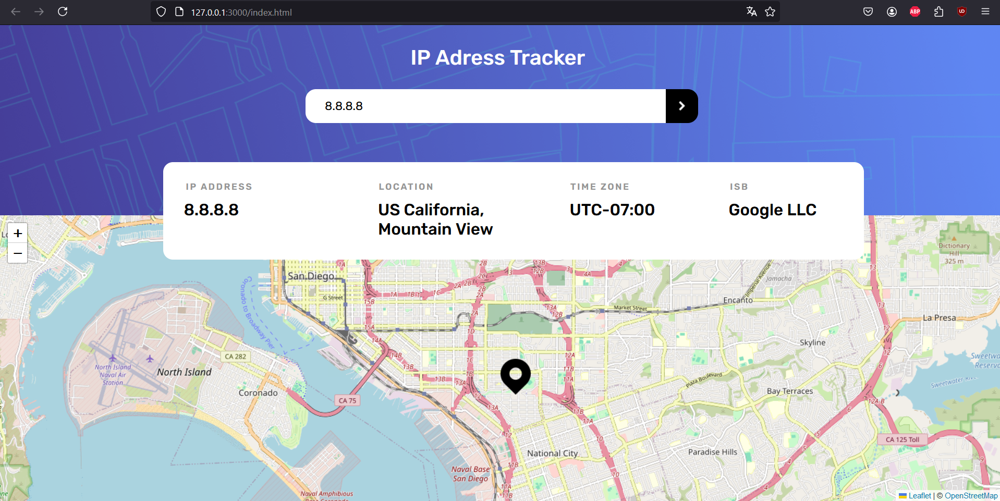

# Ip-address-tracker

### Example with google domain :

## API WEBSITE
### So we got one api and a js library to do the challenge. 

1. The first one was <a href="https://leafletjs.com/">Leaflet</a>, an open-source JavaScript library for mobile-friendly interactive maps. Really easy to manipualte and a good documentation.
2. The api we used is <a href="https://geo.ipify.org">Geo Ipify</a>, a geolocalisation api with detailled informations, like the longitude,latitude...etc. Also a good api, easy to maniupulate with javascript even if the code it self is not really javascript but jquery or ajax i think.

3. No responsive because not too much token api to perform.
4. In fine, it was a quick fast project to do.
